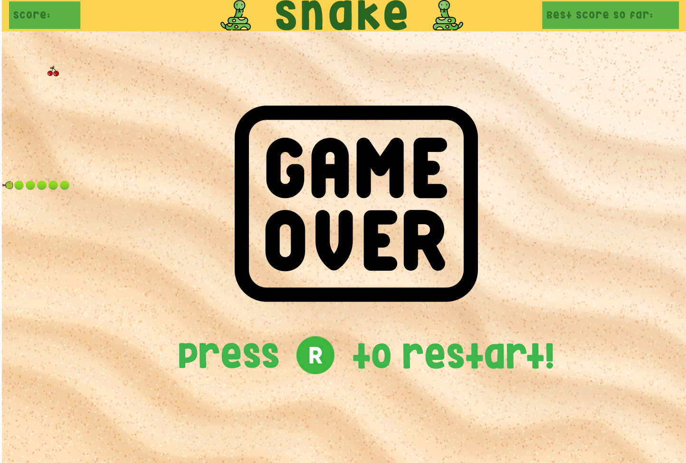

# Snake

Classic snake game developed as a part of a fullstack programming course.

## Languages and technologies

Java, Java I/O, SimpleGraphics library.   

# List of contributors

Alexandre Bento - IskandarAlter

Diana Jacinto - Di2Wag

Tiago Castilho - tcastilho10
